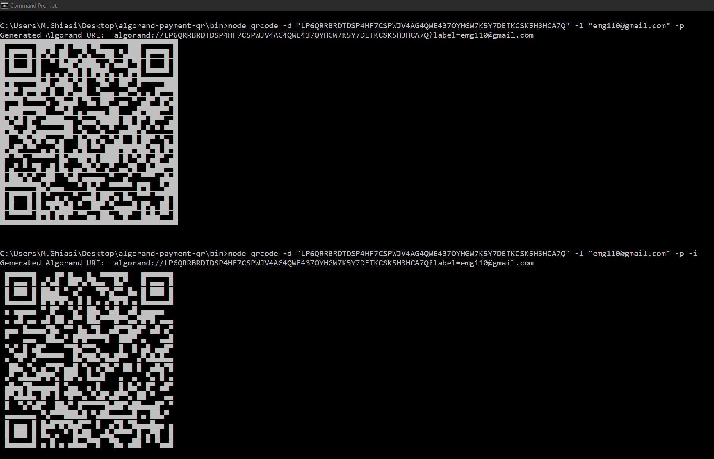
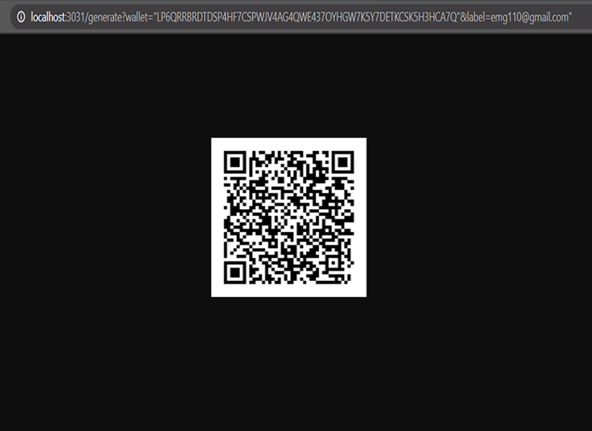
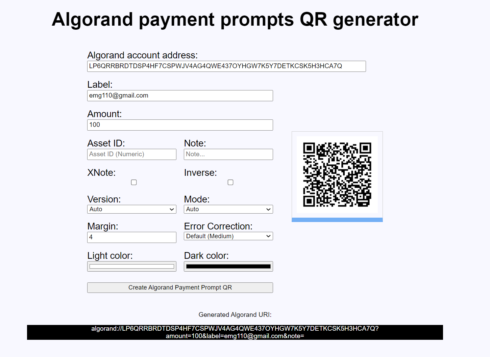

[](https://developer.algorand.org/solutions/algorand-qr-code-generator-javascript/)

# Algorand QR Code Generator
[](https://developer.algorand.org/solutions/algorand-qr-code-generator-javascript/)
[](https://www.npmjs.com/package/algorand-qrcode) [](https://standardjs.com)
[](https://github.com/emg110/algorand-qrcode/blob/master/license)

A comprehensive javascript module with a complete set of tools to generate an standard Algorand URI (RFC 3986) and  QR code, exportable to SVG, PNG and UTF8. Exported media types are File, UTF8 text and DataURL. Works in Terminal, Node and modern browsers. Contains a full set of examples including API server, static server and web form QR generator. Includes a full featured CLI to generate QR codes in terminals too.

<div style="display:block; text-align:center; align-items:center; margin:auto">
  
</div>

<p style="text-align:center; display:block; background-color:#4fcdf0; font-size:0.7em">algorand://AMESZ5UX7ZJL5M6GYEHXM63OMFCPOJ23UXCQ6CVTI2HVX6WUELYIY262WI?label=emg110@gmail.com</p>

###  [Simple Web Form Demo](https://emg110.github.io/algorandqrcode/)

###  [Algorand Developers Portal Publication](https://developer.algorand.org/solutions/algorand-qr-code-generator-javascript/)

###  [Algorand Dev Hours Presentation](https://cutt.ly/SnkO7Xl)

###  [Algorand Dev Hours Presentation Video on YouTube](https://www.youtube.com/watch?v=RzP3y42Lf4o)


## News

###  [React Version (WIP)](https://github.com/emg110/algorand-qrcode-react/)

###  [React Demo (WIP)](https://emg110.github.io/algorandqrcodereact/)


## Technical notes

- Default amount is considered in **Micro Algos** by default (what ever amount will be multiplied by 1000000 during URI creation andbefore QR Code generation) since version 1.0.0.

- Dear developers please beware to set your **wallet's mode into development mode** and network to **testnet or betanet** before getting started to avoid any unwanted transactions on mainnet which means real transfer of Algo or some assets. So please do as a developer would do.
  
  
- Algorand URI reference specificatgion: [Algorand payment prompts specification](https://developer.algorand.org/docs/reference/payment_prompts/).
  
- Requires NodeJS version later than 10. 

- Automatically checks & detecs out of scope characters and encodes them forcefully.. 
  
- HTML Escaping is optional (Since it's not yet supported by ALgorand offical wallet QR Scanning feature), activated with --html or -y (in CLI) or having `html: true` in options.
  
- This library will closely follow Algorand’s URI specification document drafts and published versions closely as well as [Algorand official Wallet](https://algorandwallet.com/)QR Scanner feature to match and adopt new features, specification requirements and extensions.
 

## Table of contents

- [Screenshots](#screenshots)
- [Highlights](#highlights)
- [Algorand URI's ABNF Grammar](#algorand-uri-abnf-grammar)
- [Installation](#installation)
- [Usage](#usage)
- [Error correction level](#error-correction-level)
- [API](#api)
- [Comming soon](#coming-soon)
- [Mentioned Trademarks](#mentioned-trademarks)
- [Credits](#credits)
- [License](#license)

## Screenshots
<div style="display:block">





</div>

## Highlights
- This library can be built for browser, be imported or required in NodeJS or directly rendered in terminal.
- Supports RFC 3986 and Algorand URI ABNF Grammar.
- Optionally can automatically escape HTML (`--html` in CLI or `{html:true}` in code).
- Validates Algorand fields on client side without js-algorand-sdk (address, amount, asset ID, ...).
- CLI utility.
- Save QR code as image (SVG, PNG, JPEG,...).
- Support for some styling and colors (dark , light,..).
- Support for chinese, cyrillic, greek and japanese characters in transaction labels and notes.
- Auto generates optimized segments for best data compression and smallest QR Code size.
- App agnostic readability, Generated QR Codes by definition are app agnostic.

## Algorand URI ABNF Grammar

```javascript
    algorandurn     = "algorand://" algorandaddress [ "?" algorandparams ]
    algorandaddress = *base32
    algorandparams  = algorandparam [ "&" algorandparams ]
    algorandparam   = [ amountparam / labelparam / noteparam / assetparam / otherparam ]
    amountparam     = "amount=" *digit
    labelparam      = "label=" *qchar
    assetparam      = "asset=" *digit
    noteparam       = (xnote | note)
    xnote           = "xnote=" *qchar
    note            = "note=" *qchar
```

## Installation
Inside your project folder do:

```shell
npm install --save algorand-qrcode
```
and then 

```shell
cd bin && node qrcode [options]
```

or, install it globally to use `qrcode` from the command line to save Algorand URI qrcode and barcode   images or generate ones you can view in your terminal.

```shell
npm install -g algorand-qrcode
```
and then 

```shell
qrcode [options]
```

## Usage
### CLI

```
Usage: qrcode [options]

Algorand switch:
  -x, --xnote Expects "xnote" instread of "note" for Algorand URI      [boolean]
  -y, --html  Automatically HTML escapes all text strings              [boolean]

Algorand options:
  -a, --amount Amount (in Micro Algos) of Algorand transaction          [number]
  -l, --label Label of Algorand transaction                             [string]
  -s, --asset Algorand asset id (in case of Algorand ASA transfer)      [string]
  -n, --note note/xnote (depends on -a | --xnote switch)                [string]
  -d, --dest Destination Wallet address (Algorand account address)      [string]

QR Code options:
  -v, --qversion  QR Code symbol version (1 - 40)                       [number]
  -e, --error     Error correction level           [choices: "L", "M", "Q", "H"]
  -m, --mask      Mask pattern (0 - 7)                                  [number]


Renderer options:
  -t, --type        Output type                  [choices: "png", "svg", "utf8"]
  -w, --width       Image width (px)                                    [number]
  -r, --ratio       Scale ratio factor                                  [number]
  -q, --qzone       Quiet zone size                                     [number]
  -b, --background  Light RGBA hex color
  -f, --foreground   Dark RGBA hex color
  -p, --puny  Output smaller QR code to terminal                       [boolean]
  -i, --inverse  Invert foreground and background colors               [boolean]

Options:
  -o, --output  Output file
  -h, --help    Show help                                              [boolean]
  --version     Show version number                                    [boolean]

Examples:
    - Draw Algorand USDT(Tether) payment transaction QR Code in terminal window:
    node qrcode -d "AMESZ5UX7ZJL5M6GYEHXM63OMFCPOJ23UXCQ6CVTI2HVX6WUELYIY262WI" -a 25 -s 45 -n "This is an Algorand USDT Tether payment transaction QR Code" -p

    - Save Algorand contact label as png image:
    node qrcode -d "AMESZ5UX7ZJL5M6GYEHXM63OMFCPOJ23UXCQ6CVTI2HVX6WUELYIY262WI" -l "emg110@gmail.com" -o emg110ContactQrCode.png 

    - Use red as foreground color:
    node qrcode -d "AMESZ5UX7ZJL5M6GYEHXM63OMFCPOJ23UXCQ6CVTI2HVX6WUELYIY262WI" -f F00 -o paymentQR.png -a 12 -x -n "This is an Algorand Algo payment transaction QR Code"
```
If not specified, output type is guessed from file extension.<br>
Recognized extensions are `png`, `svg` and `txt`.

### Browser
`algorand-qrcode` can be used in browser through including the precompiled bundle present in `build/` folder.


```javascript
// index.js -> bundle.js
var QRCode = require('algorand-qrcode')
var canvas = document.getElementById('canvas')

QRCode.toCanvas(canvas, {wallet:"AMESZ5UX7ZJL5M6GYEHXM63OMFCPOJ23UXCQ6CVTI2HVX6WUELYIY262WI", label:"emg110@gmail.com"}, function (error) {
  if (error) console.error(error)
  console.log('success!');
})
```

#### Precompiled bundle
```html
<canvas id="canvas"></canvas>

<script src="/build/qrcode.js"></script>
<script>
  QRCode.toCanvas(document.getElementById('canvas'), {wallet:"AMESZ5UX7ZJL5M6GYEHXM63OMFCPOJ23UXCQ6CVTI2HVX6WUELYIY262WI", label:"emg110@gmail.com"}, function (error) {
    if (error) console.error(error)
    console.log('success!');
  })
</script>
```

If you install through `npm`, precompiled files will be available in `node_modules/algorand-qrcode/build/` folder.

The precompiled bundle have support for [Internet Explorer 10+, Safari 5.1+, and all evergreen browsers](https://browserl.ist/?q=defaults%2C+IE+%3E%3D+10%2C+Safari+%3E%3D+5.1).

### NodeJS
Require the module `algorand-qrcode`

```javascript
var QRCode = require('algorand-qrcode')

QRCode.toDataURL({wallet:"AMESZ5UX7ZJL5M6GYEHXM63OMFCPOJ23UXCQ6CVTI2HVX6WUELYIY262WI", label:"emg110@gmail.com"}, function (err, url) {
  console.log(url)
})
```

render a qrcode for the terminal
```js
var QRCode = require('algorand-qrcode')

QRCode.toString({type:'terminal',wallet:"AMESZ5UX7ZJL5M6GYEHXM63OMFCPOJ23UXCQ6CVTI2HVX6WUELYIY262WI", label:"emg110@gmail.com"}, function (err, url) {
  console.log(url)
})
```

### ES6/ES7
Promises and Async/Await can be used in place of callback function.

```javascript
import QRCode from 'algorand-qrcode'

// With promises
QRCode.toDataURL({})
  .then(url => {
    console.log(url)
  })
  .catch(err => {
    console.error(err)
  })

// With async/await
const generateQR = async text => {
  try {
    console.log(await QRCode.toDataURL({wallet:"AMESZ5UX7ZJL5M6GYEHXM63OMFCPOJ23UXCQ6CVTI2HVX6WUELYIY262WI", label:"emg110@gmail.com"}))
  } catch (err) {
    console.error(err)
  }
}
```

## Error correction level
Error correction capability allows to successfully scan a QR Code even if the symbol is dirty or damaged.
Four levels are available to choose according to the operating environment.

Higher levels offer a better error resistance but reduce the symbol's capacity.<br>
If the chances that the QR Code symbol may be corrupted are low (for example if it is showed through a monitor)
is possible to safely use a low error level such as `Low` or `Medium`.

Possible levels are shown below:

| Level            | Error resistance |
|------------------|:----------------:|
| **L** (Low)      | **~7%**          |
| **M** (Medium)   | **~15%**         |
| **Q** (Quartile) | **~25%**         |
| **H** (High)     | **~30%**         |

The percentage indicates the maximum amount of damaged surface after which the symbol becomes unreadable.

Error level can be set through `options.errorCorrectionLevel` property.<br>
If not specified, the default value is `M`.

```javascript
QRCode.toDataURL({wallet:"AMESZ5UX7ZJL5M6GYEHXM63OMFCPOJ23UXCQ6CVTI2HVX6WUELYIY262WI", label:"emg110@gmail.com", errorCorrectionLevel: 'H'}, function (err, url) {
  console.log(url)
})
```

## API
Browser:
- [create()](#createtext-options)
- [toCanvas()](#tocanvascanvaselement-text-options-cberror)
- [toDataURL()](#todataurltext-options-cberror-url)
- [toString()](#tostringtext-options-cberror-string)

Server:
- [create()](#createtext-options)
- [toCanvas()](#tocanvascanvas-text-options-cberror)
- [toDataURL()](#todataurltext-options-cberror-url-1)
- [toString()](#tostringtext-options-cberror-string-1)
- [toFile()](#tofilepath-text-options-cberror)
- [toFileStream()](#tofilestreamstream-text-options)

### Browser API
#### `create([options])`
Creates QR Code symbol and returns a qrcode object.

##### `options`

See [QR Code options](#qr-code-options).<br>
See [Algorand URI options](#algorand-uri-params).

##### `returns`
Type: `Object`

```javascript
// QRCode object
{
  modules,              // Bitmatrix class with modules data
  version,              // Calculated QR Code version
  errorCorrectionLevel, // Error Correction Level
  maskPattern,          // Calculated Mask pattern
  segments              // Generated segments
}
```

<br>

#### `toCanvas(canvasElement, [options], [cb(error)])`
#### `toCanvas([options], [cb(error, canvas)])`
Draws qr code symbol to canvas.<br>
If `canvasElement` is omitted a new canvas is returned.

##### `canvasElement`
Type: `DOMElement`

Canvas where to draw QR Code.


##### `options`

See [All Options](#all-options).<br>
See [Algorand URI options](#algorand-uri-params).

##### `cb`
Type: `Function`

Callback function called on finish.

##### Example
```javascript
QRCode.toCanvas({wallet:"AMESZ5UX7ZJL5M6GYEHXM63OMFCPOJ23UXCQ6CVTI2HVX6WUELYIY262WI", label:"emg110@gmail.com"}, function (err, canvas) {
  if (err) throw err

  var container = document.getElementById('container')
  container.appendChild(canvas)
})
```

<br>

#### `toDataURL([options], [cb(error, url)])`
#### `toDataURL(canvasElement, [options], [cb(error, url)])`
Returns a Data URI containing a representation of the QR Code image.<br>
If provided, `canvasElement` will be used as canvas to generate the data URI.

##### `canvasElement`
Type: `DOMElement`

Canvas where to draw QR Code.

##### `options`

- ###### `type`
  Type: `String`<br>
  Default: `image/png`

  Data URI format.<br>
  Possible values are: `image/png`, `image/jpeg`, `image/webp`.<br>

- ###### `rendererOpts.quality`
  Type: `Number`<br>
  Default: `0.92`

  A Number between `0` and `1` indicating image quality if the requested type is `image/jpeg` or `image/webp`.

See [All Options](#all-options).<br>
See [Algorand URI options](#algorand-uri-params).

##### `cb`
Type: `Function`

Callback function called on finish.

##### Example
```javascript
var opts = {
  wallet:"AMESZ5UX7ZJL5M6GYEHXM63OMFCPOJ23UXCQ6CVTI2HVX6WUELYIY262WI",
  label:"emg110@gmail.com",
  errorCorrectionLevel: 'H',
  type: 'image/jpeg',
  quality: 0.3,
  margin: 1,
  color: {
    dark:"#010599FF",
    light:"#FFBF60FF"
  }
}

QRCode.toDataURL(opts, function (err, url) {
  if (err) throw err

  var img = document.getElementById('image')
  img.src = url
})
```
<br>

#### `toString([options], [cb(error, string)])`

Returns a string representation of the QR Code.<br>


##### `options`

- ###### `type`
  Type: `String`<br>
  Default: `utf8`

  Output format.<br>
  Possible values are: `terminal`,`utf8`, and `svg`.

See [All Options](#all-options).<br>
See [Algorand URI options](#algorand-uri-params).

##### `cb`
Type: `Function`

Callback function called on finish.

##### Example
```javascript
QRCode.toString({wallet:"AMESZ5UX7ZJL5M6GYEHXM63OMFCPOJ23UXCQ6CVTI2HVX6WUELYIY262WI", label:"emg110@gmail.com"}, function (err, string) {
  if (err) throw err
  console.log(string)
})
```

<br>


### Server API
#### `create([options])`
See [create](#createtext-options).<br>
See [Algorand URI options](#algorand-uri-params).

<br>

#### `toCanvas(canvas, [options], [cb(error)])`
Draws qr code symbol to [node canvas](https://github.com/Automattic/node-canvas).


##### `options`

See [All Options](#all-options).<br>
See [Algorand URI options](#algorand-uri-params).

##### `cb`
Type: `Function`

Callback function called on finish.

<br>

#### `toDataURL([options], [cb(error, url)])`
Returns a Data URI containing a representation of the QR Code image.<br>
Only works with `image/png` type for now.


##### `options`
See [All Options](#all-options).<br>
See [Algorand URI options](#algorand-uri-params).

##### `cb`
Type: `Function`

Callback function called on finish.

<br>

#### `toString([options], [cb(error, string)])`
Returns a string representation of the QR Code.<br>
If choosen output format is `svg` it will returns a string containing xml code.

##### `options`

###### `type`
  Type: `String`<br>
  Default: `utf8`

  Output format.<br>
  Possible values are: `utf8`, `svg`, `terminal`.

See [All Options](#all-options).<br>
See [Algorand URI options](#algorand-uri-params).

##### `cb`
Type: `Function`

Callback function called on finish.

##### Example
```javascript
QRCode.toString({wallet:"AMESZ5UX7ZJL5M6GYEHXM63OMFCPOJ23UXCQ6CVTI2HVX6WUELYIY262WI", label:"emg110@gmail.com", type: 'utf8'}, function (err, string) {
  if (err) throw err
  console.log(string)
})
```

<br>

#### `toFile(path, [options], [cb(error)])`
Saves QR Code to image file.<br>
If `options.type` is not specified, the format will be guessed from file extension.<br>
Recognized extensions are `png`, `svg`, `txt`.

##### `path`
Type: `String`

Path where to save the file.


##### `options`

- ###### `type`
  Type: `String`<br>
  Default: `png`

  Output format.<br>
  Possible values are: `png`, `svg`, `utf8`.

- ###### `rendererOpts.deflateLevel` **(png only)**
  Type: `Number`<br>
  Default: `9`

  Compression level for deflate.

- ###### `rendererOpts.deflateStrategy` **(png only)**
  Type: `Number`<br>
  Default: `3`

  Compression strategy for deflate.

See [All Options](#all-options).<br>
See [Algorand URI options](#algorand-uri-params).

##### `cb`
Type: `Function`

Callback function called on finish.

##### Example
```javascript
QRCode.toFile('path/to/filename.png', {
  wallet:"AMESZ5UX7ZJL5M6GYEHXM63OMFCPOJ23UXCQ6CVTI2HVX6WUELYIY262WI",
  label:"emg110@gmail.com",
  color: {
    dark: '#00F',  // Blue dots
    light: '#0000' // Transparent background
  }
}, function (err) {
  if (err) throw err
  console.log('done')
})
```

<br>

#### `toFileStream(stream, [options])`
Writes QR Code image to stream. Only works with `png` format for now.

##### `stream`
Type: `stream.Writable`

Node stream.


##### `options`

See [All Options](#all-options).<br>
See [Algorand URI options](#algorand-uri-params).


### All Options

#### QR Code options

##### `version`
  Type: `Number`<br>

  QR Code version. If not specified the more suitable value will be calculated.
    
##### `errorCorrectionLevel`
  Type: `String`<br>
  Default: `M`

  Error correction level.<br>
  Possible values are `low, medium, quartile, high` or `L, M, Q, H`.

##### `maskPattern`
  Type: `Number`<br>

  Mask pattern used to mask the symbol.<br>
  Possible values are `0`, `1`, `2`, `3`, `4`, `5`, `6`, `7`.<br>
  If not specified the more suitable value will be calculated.

##### `html`
  Type: `Boolean`<br>

  Specifies if the text string fields are to be HTML Escaped or not.


#### Algorand URI params

##### `xnote`
  Type: `Boolean`<br>

  Specifies if the xnote or note field is used for Algorand URI construction.
  
##### `amount`
  Type: `Number`<br>

  Amount of Algorand transaction in MicroAlgos or Standard Asset Unit.
  
##### `label`
  Type: `String`<br>

  Label of Algorand transaction.

##### `asset`
  Type: `String`<br>

  Asset Id of Algorand transaction if used. If not specified , Algo will be used as fungible token.
  
##### `note`
  Type: `String`<br>

  note or xnote field content of Algorand transaction. The xnote option determines the name of the field with this content to be note or xnote.


#### Renderers options
##### `margin`
  Type: `Number`<br>
  Default: `4`

  Define how much wide the quiet zone should be.

##### `scale`
  Type: `Number`<br>
  Default: `4`

  Scale factor. A value of `1` means 1px per modules (black dots).

##### `small`
  Type: `Boolean`<br>
  Default: `false`

  Relevant only for terminal renderer. Outputs smaller QR code.

##### `width`
  Type: `Number`<br>

  Forces a specific width for the output image.<br>
  If width is too small to contain the qr symbol, this option will be ignored.<br>
  Takes precedence over `scale`.

##### `color.dark`
Type: `String`<br>
Default: `#000000ff`

Color of dark module. Value must be in hex format (RGBA).<br>
Note: dark color should always be darker than `color.light`.

##### `color.light`
Type: `String`<br>
Default: `#ffffffff`

Color of light module. Value must be in hex format (RGBA).<br>

## Coming Soon

  > GS1 QR Codes : What defines a GS1 qrcode is a header with metadata that describes your gs1 information.
  
  > More options: More configuration options on styling.
  
  > Image printing on QR Code (position, style)
  
  > Kanji QR Code Mode

  > Advanced Masks: Advance masking formulas for practicality and beautification.
  
  > QR Code Scanner: Fast and solid QR Code scanner for many type of QR Code.
  
  > QR Code Scanner Components: QR Code Scanner HTML Component, React widget and Material-UI configurable CARD components.
                                     


## License
[MIT](https://github.com/emg110/algorand-qrcode/blob/master/license)


## Credits
> Special appreciations to  [Sheghzo](https://github.com/sheghzo/).

> This repository uses and appreciates great open source software and code by forking, extention and integration of:
-  [node-qrcode](https://github.com/soldair/node-qrcode)
-  [escape-html](https://github.com/component/escape-html)
-  [encodeurl](https://github.com/pillarjs/encodeurl)
  
> The idea for this lib was inspired by: Algorand developers portal Article [Payment Prompts with Algorand Mobile Wallet](https://developer.algorand.org/articles/payment-prompts-with-algorand-mobile-wallet/ ) ,from Jason Paulos.


## Mentioned Trademarks
"QR Code" curtsey of :<br>
[](https://www.denso-wave.com)


"Algorand" curtsey of:<br>
[](https://algorand.com)

